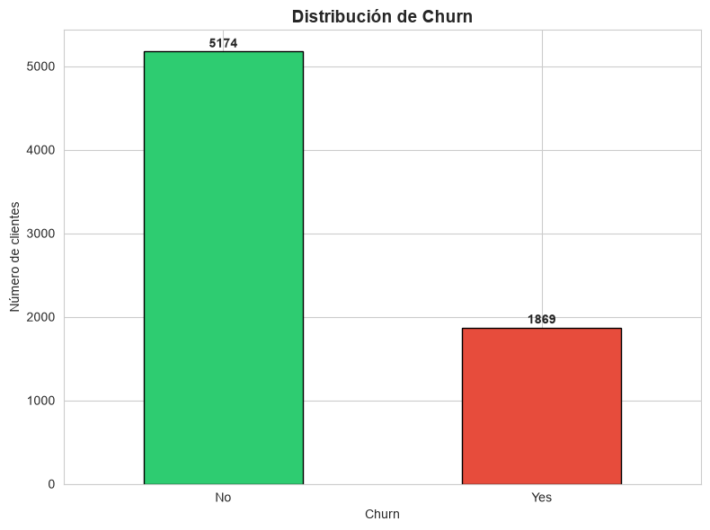
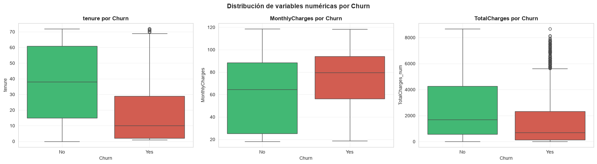
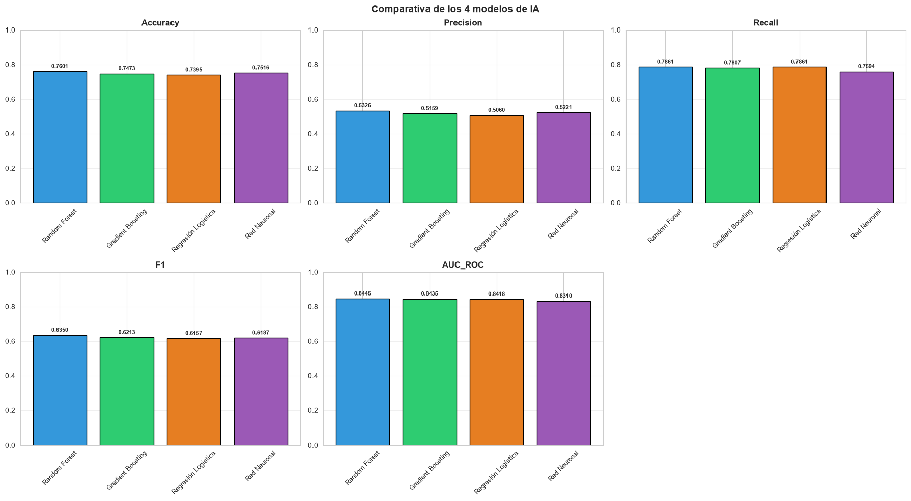
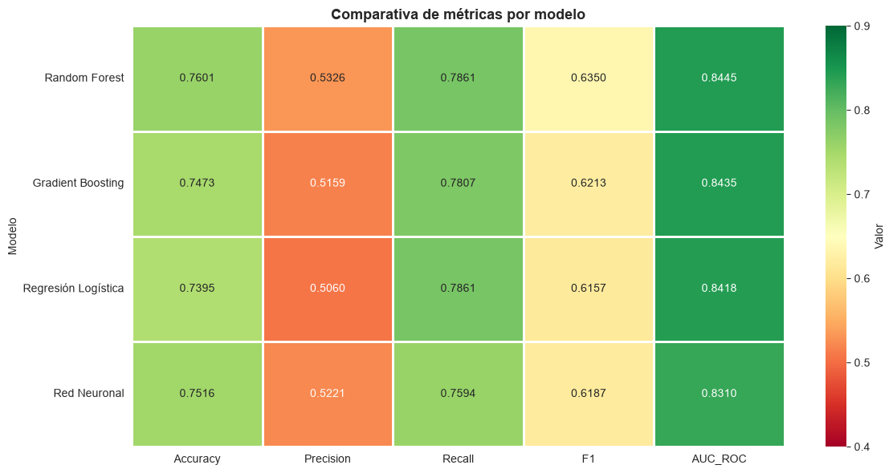
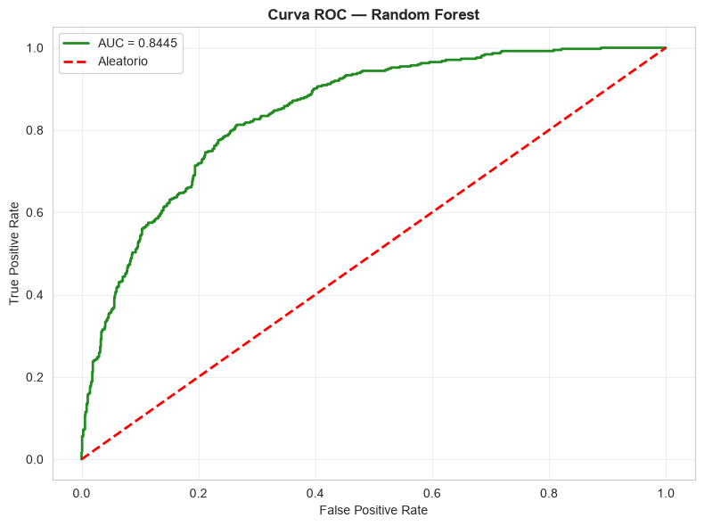
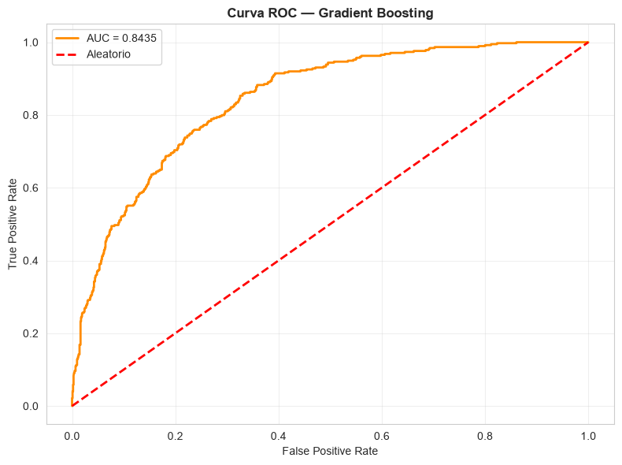
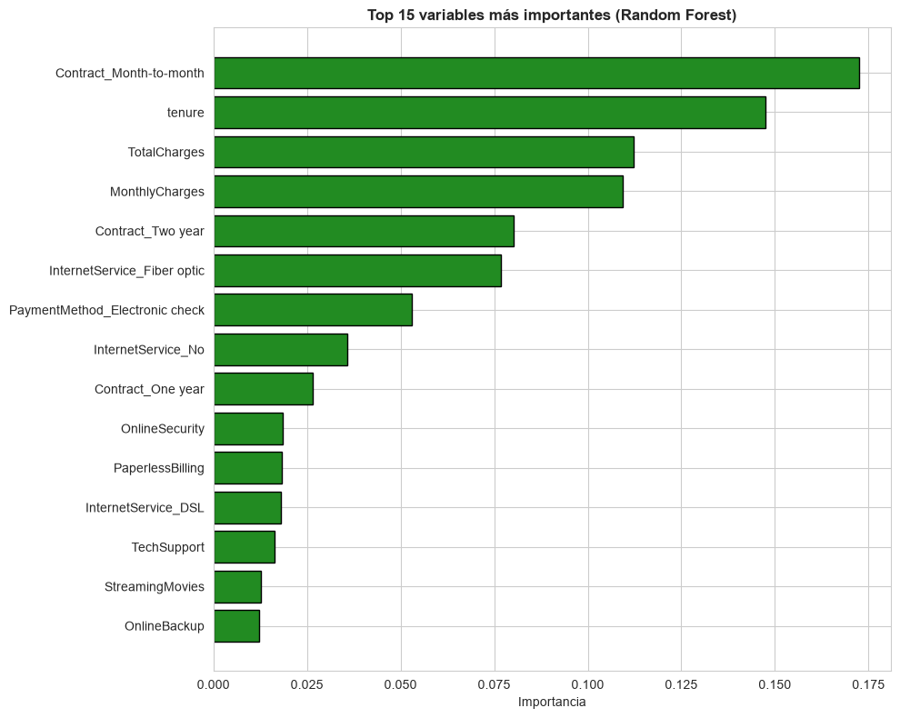
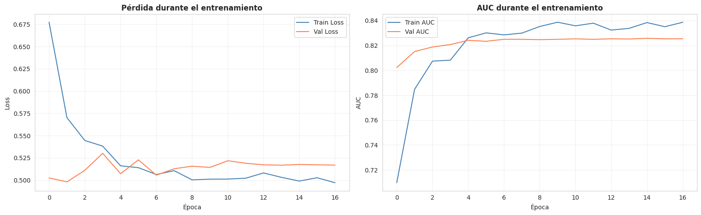

# 🧠 Reto 9 — Proyecto completo de Business Analytics

[](https://www.python.org/)
[](https://scikit-learn.org/)
[](https://www.tensorflow.org/)
[](https://keras.io/)
[](https://pandas.pydata.org/)
[](https://powerbi.microsoft.com/)
[](LICENSE)
[]()
[](https://www.kaggle.com/datasets/blastchar/telco-customer-churn)

Proyecto integrador final que aplica **técnicas avanzadas de Inteligencia Artificial** (Machine Learning y Deep Learning) sobre el dataset **Telco Customer Churn** para predecir el abandono de clientes.

---

## 🎯 Objetivo

Desarrollar un **proyecto completo de Business Analytics** que incluya:

- **Análisis descriptivo, predictivo y prescriptivo**
- **4 modelos de IA**: Regresión Logística, Random Forest, Gradient Boosting y Red Neuronal
- **Recomendaciones estratégicas** para reducir el churn

---

## 📊 Dataset

| Atributo | Valor |
|---|---|
| **Fuente** | [Kaggle — IBM Telco Customer Churn](https://www.kaggle.com/datasets/blastchar/telco-customer-churn) |
| **Registros** | 7.043 clientes |
| **Variables** | 21 (demografía, servicios, facturación) |
| **Variable objetivo** | `Churn` (Yes/No) |
| **Tasa de churn** | 26,54% |

---

## 🛠️ Tecnologías utilizadas

<p align="center">
  
  
  
  
  
  
</p>

| Herramienta | Uso |
|---|---|
| **Python 3.13** | Lenguaje principal |
| **pandas** | Manipulación de datos |
| **scikit-learn** | Modelos de ML clásicos |
| **TensorFlow / Keras** | Red Neuronal (Deep Learning) |
| **matplotlib / seaborn** | Visualizaciones |
| **Power BI** | Dashboard interactivo |

---

## 📁 Estructura del proyecto

```
Reto9_BusinessAnalytics/
│
├── datos/
│   ├── raw/                              # Dataset original (Kaggle)
│   │   └── telco_churn.csv
│   └── limpios/                          # Dataset preparado + splits
│       ├── telco_preparado.csv
│       ├── X_train.csv · y_train.csv
│       └── X_test.csv  · y_test.csv
│
├── scripts/                              # Scripts Python por fase
│   ├── 01_exploracion.py
│   ├── 02_preparacion.py
│   ├── 03_regresion_logistica.py
│   ├── 04_random_forest.py
│   ├── 05_gradient_boosting.py
│   ├── 06_evaluacion_comparativa.py
│   └── 07_visualizaciones_pdf.py
│
├── notebooks/                            # Notebook de la Red Neuronal
│   └── Reto9_Red_Neuronal_JuditGiravent.ipynb
│
├── modelos/                              # Modelos entrenados
│   ├── modelo_regresion_logistica.pkl
│   ├── modelo_random_forest.pkl
│   ├── modelo_gradient_boosting.pkl
│   ├── modelo_red_neuronal.keras
│   └── scaler.pkl
│
├── salidas/
│   ├── figuras/                          # 19 visualizaciones PNG
│   └── resultados/                       # 8 CSVs con métricas
│
├── codigo/                               # Código completo (ZIP)
│   └── Codigo_Proyecto_BA_Reto9_JuditGiravent.zip
│
├── docs/                                 # Entregables
│   ├── Documentacion_Proyecto_BA_Reto9_JuditGiravent.md
│   ├── Documentacion_Proyecto_BA_Reto9_JuditGiravent.pdf
│   ├── Informe_Evaluacion_Modelos_BA_Reto9_JuditGiravent.md
│   ├── Informe_Evaluacion_Modelos_BA_Reto9_JuditGiravent.pdf
│   ├── Visualizaciones_Dashboard_BA_Reto9_JuditGiravent.pdf
│   └── Presentacion_Proyecto_BA_Reto9_JuditGiravent.pptx
│
├── Certificado_de_participacin.pdf       # Certificado del curso
├── Diploma_de_aprovechamiento.pdf        # Diploma
├── .gitignore
├── LICENSE
└── README.md
```

---

## 📊 Resultados de los modelos

| Modelo | Accuracy | Precision | Recall | F1 | AUC-ROC |
|---|---:|---:|---:|---:|---:|
| **Random Forest** 🥇 | **0,7601** | **0,5326** | **0,7861** | **0,6350** | **0,8445** |
| Gradient Boosting | 0,7473 | 0,5159 | 0,7807 | 0,6213 | 0,8435 |
| Regresión Logística | 0,7395 | 0,5060 | 0,7861 | 0,6157 | 0,8418 |
| Red Neuronal | 0,7516 | 0,5221 | 0,7594 | 0,6187 | 0,8310 |

**Mejor modelo**: **Random Forest** con AUC-ROC 0,8445 y F1-score 0,6350.

---

## 💡 Hallazgos clave

1. **El 26,54% de los clientes abandonan** cada año (1.869 de 7.043).
2. **El contrato Month-to-month tiene 42,7% de churn**, vs 2,8% del Two year.
3. **Los churners tienen tenure medio de 18 meses**, vs 37,6 de los que se quedan.
4. **La Fibra Óptica concentra el 41,9% del churn**.
5. **Random Forest es el mejor modelo** (AUC-ROC 0,8445).

---

## 🎯 Recomendaciones estratégicas

| # | Acción | Clientes retenidos/año | Impacto |
|---|---|---|---|
| 1 | Incentivar contratos largos | 150 | **135.000 €** |
| 2 | Programa de retención temprana | 100 | **90.000 €** |
| 3 | Mejorar la oferta de Fibra | 200 | **180.000 €** |
| 4 | Segmentación por valor | 120 | **130.000 €** |

**Impacto total**: **535.000 €/año**
**Inversión estimada**: 80.000 €
**ROI**: **6,7x**

---

## 🚀 Cómo reproducir el proyecto

### 1. Clonar el repositorio

```bash
git clone https://github.com/everest9957/Reto9_BusinessAnalytics.git
cd Reto9_BusinessAnalytics
```

### 2. Instalar dependencias

```bash
pip install pandas numpy scikit-learn tensorflow matplotlib seaborn
```

### 3. Descargar el dataset

Descarga `WA_Fn-UseC_-Telco-Customer-Churn.csv` desde [Kaggle](https://www.kaggle.com/datasets/blastchar/telco-customer-churn) y colócalo en `datos/raw/` como `telco_churn.csv`.

### 4. Ejecutar los scripts en orden

```bash
cd scripts

python 01_exploracion.py
python 02_preparacion.py
python 03_regresion_logistica.py
python 04_random_forest.py
python 05_gradient_boosting.py
python 06_evaluacion_comparativa.py
python 07_visualizaciones_pdf.py
```

Para la **red neuronal**, abre el notebook:

```
notebooks/Reto9_Red_Neuronal_JuditGiravent.ipynb
```

Los resultados se guardan en:
- `salidas/figuras/` → 19 visualizaciones
- `salidas/resultados/` → 8 CSVs con métricas
- `modelos/` → 5 archivos de modelo

---

## 📸 Visualizaciones destacadas

### Análisis exploratorio





### Comparativa de modelos





### Curvas ROC





### Importancia de variables



### Red Neuronal



---

## 📄 Documentación

| Documento | Enlace |
|---|---|
| 📘 **Documentación completa del proyecto** | [Ver documento](docs/Documentacion_Proyecto_BA_Reto9_JuditGiravent.pdf) |
| 📝 **Documentación completa (MD)** | [Ver documento](docs/Documentacion_Proyecto_BA_Reto9_JuditGiravent.md) |
| 📊 **Informe de evaluación de modelos** | [Ver informe](docs/Informe_Evaluacion_Modelos_BA_Reto9_JuditGiravent.pdf) |
| 📝 **Informe de evaluación (MD)** | [Ver informe](docs/Informe_Evaluacion_Modelos_BA_Reto9_JuditGiravent.md) |
| 📈 **Visualizaciones del dashboard** | [Ver visualizaciones](docs/Visualizaciones_Dashboard_BA_Reto9_JuditGiravent.pdf) |
| 🎤 **Presentación ejecutiva** | [Ver presentación](docs/Presentacion_Proyecto_BA_Reto9_JuditGiravent.pptx) |
| 💾 **Código completo (ZIP)** | [Descargar código](codigo/Codigo_Proyecto_BA_Reto9_JuditGiravent.zip) |
| 🎓 **Certificado de participación** | [Ver certificado](Certificado_de_participacin.pdf) |
| 🏆 **Diploma de aprovechamiento** | [Ver diploma](Diploma_de_aprovechamiento.pdf) |

---

## 🎓 Conclusiones

Este proyecto integra las **tres dimensiones del Business Analytics**:

- **Descriptivo**: análisis de patrones de churn (contratos, tenure, servicios)
- **Predictivo**: 4 modelos de IA con AUC-ROC superiores a 0,83
- **Prescriptivo**: 4 recomendaciones accionables con impacto de **535.000 €/año**

**El churn es predecible y prevenible**. Con un sistema automatizado basado en Random Forest, la empresa puede **anticipar el abandono** y activar campañas de retención personalizadas.

---

## 🔄 Próximas mejoras

- [ ] Implementar SHAP para explicabilidad individual
- [ ] Automatizar el pipeline con MLflow
- [ ] Desplegar el modelo en producción (API REST con FastAPI)
- [ ] Sistema de alertas en tiempo real
- [ ] Ampliar con más datos históricos y análisis temporal

---

## 👤 Autora

**Judit Giravent Pineda**

- GitHub: [@everest9957](https://github.com/everest9957)
- LinkedIn: [judit-giravent-27b167156](https://www.linkedin.com/in/judit-giravent-27b167156/)
- Email: everest9957@gmail.com

---

## 📜 Licencia

Este proyecto está bajo la **Licencia MIT**. Consulta el archivo [LICENSE](LICENSE) para más detalles.

---

## 🙏 Agradecimientos

- [Kaggle — IBM Telco Customer Churn](https://www.kaggle.com/datasets/blastchar/telco-customer-churn) por el dataset.
- [scikit-learn](https://scikit-learn.org/), [TensorFlow](https://www.tensorflow.org/) y [Keras](https://keras.io/) por las librerías de ML/DL.

---

⭐ Si este proyecto te ha resultado útil, considera darle una estrella en GitHub.